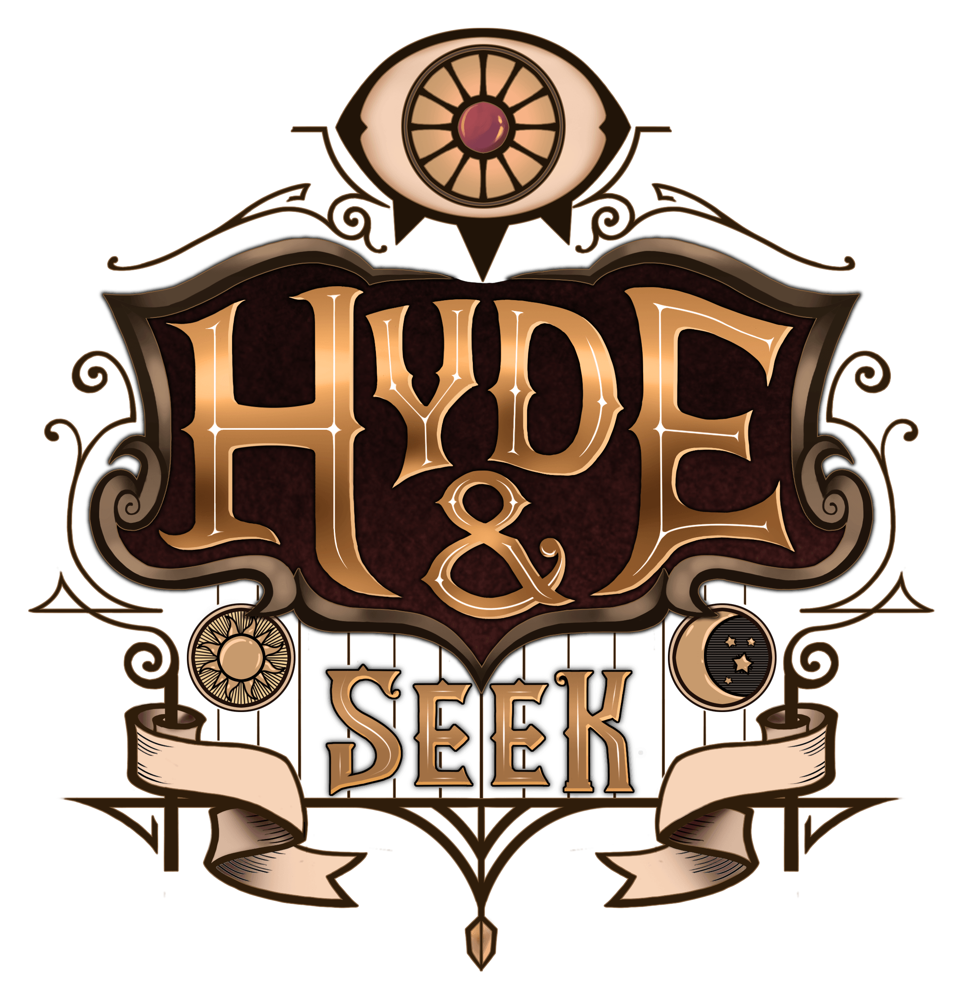

## Description
- Title: Hyde & Seek
- Duration: Aug 2019 - Present (30 weeks)
- Team Size: 11
- Custom Engine (C++) with C# Scripting

Hyde & Seek is a "Four In, One Out" local/networked party game where four innocent captives are pitted against one another in a depraved Victorian scavenger hunt.
I worked on engine/editor features, gameplay programming as well as game and level design.

## Roles
### Engine/Editor Programming
In the first half of the project (Aug 2019 - Dec 2019), I focused mainly on the engine/editor.
Here are some notable features I did.

#### Reflection & Serialization
One of the first core features I worked on for the engine was C++ Reflection.
All reflected class/struct/enums and their members are registered in one file.
In runtime, we can obtain types using strings, construct instances using types, and visit any reflected objects.
For serialization, we chose to use YAML, as YAML was much more readable and plays better with version control.
I wrote a custom subset of YAML (as we didn't need all the features), as well as a binary serializer.

#### Shader Graph
One of the achievements I made for the engine/editor was a custom Material Editor.
I worked on both the frontend in the editor, as well as the backend in the compilation of the shader graph.
I also helped integrating it in the graphics pipeline.
As an example, here is a sparkle material I made for a particle system VFX.
Here is an [article](blog.undefinist.com/shader-graph/) I wrote about it.

#### Particle System
I also built the particle system *system* for the engine/editor, where I used Unity's Particle System components as reference.
I also integrated it into the rendering pipeline: buffering the data for instancing, as well as writing the vertex shader for billboarding.

### Gameplay Programming
In the second half of the project (Jan 2019 - Apr 2019), I focused mainly on gameplay scripting.
I worked on a variety of scripts and systems, such as the player controller, game loop, as well as adding feedback.
I also wrote a Tween Manager to make it easier to tween and make sequences.

I had not worked on networked games before, so dealing with networking was very new to me.
In this project, I learnt a lot about networking and synchronization between the server and clients via *Remote Procedure Calls*.